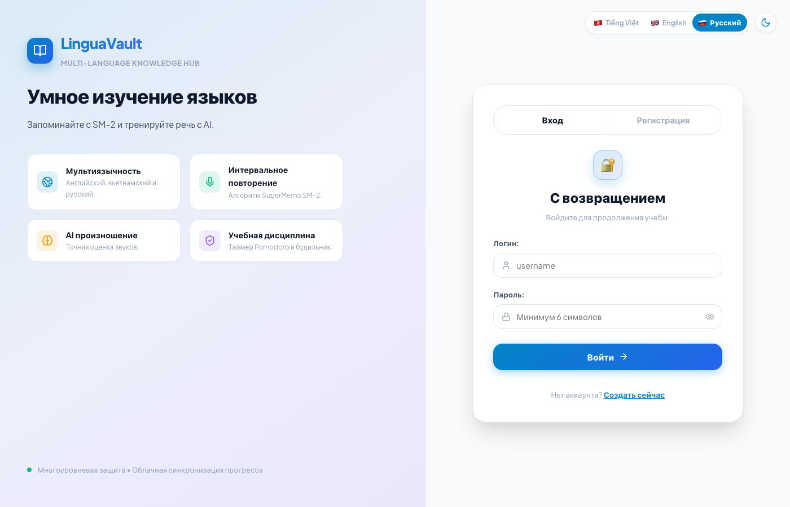
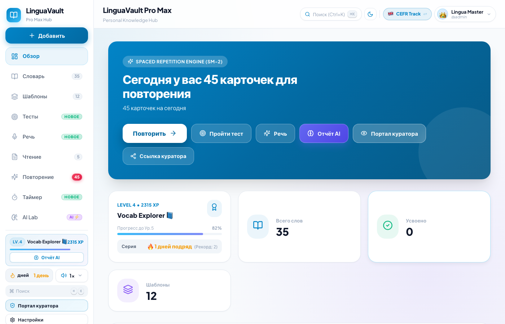
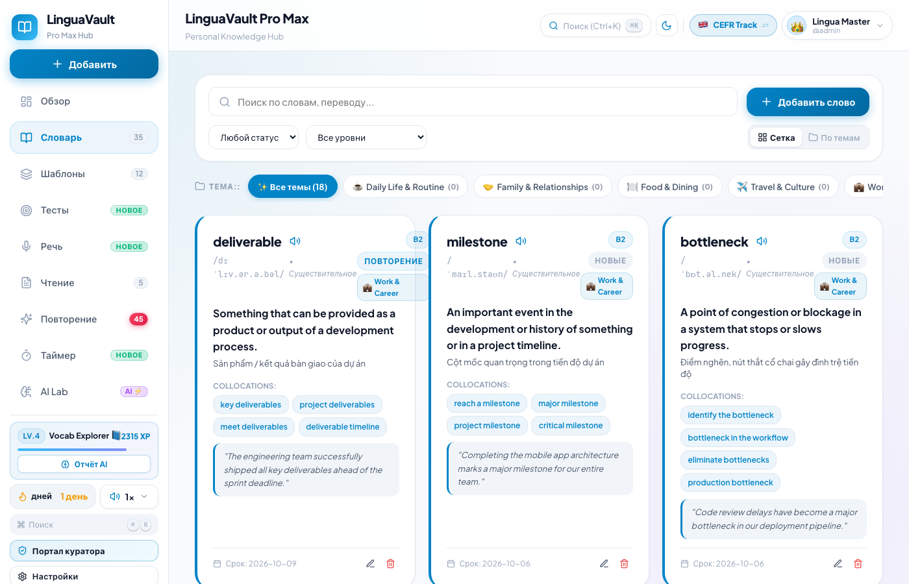
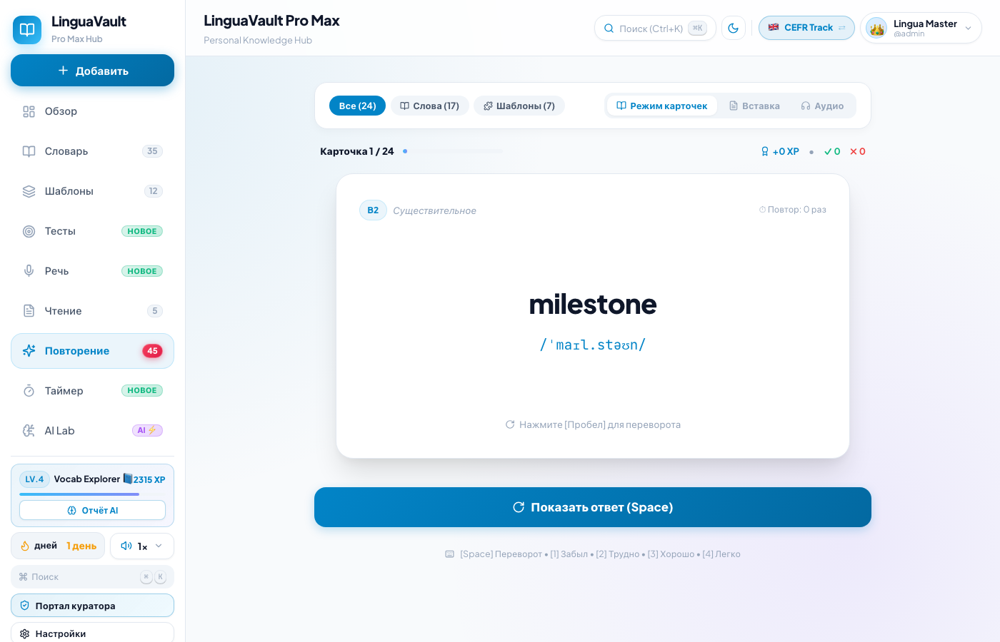
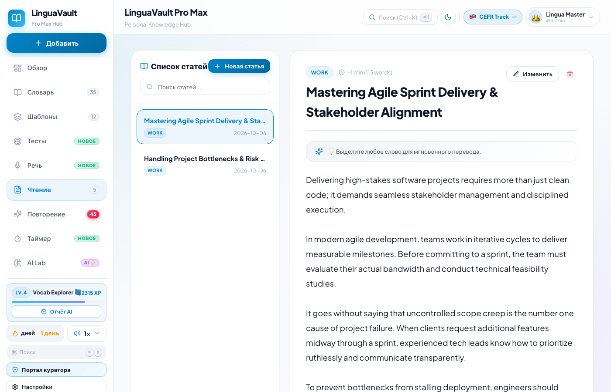
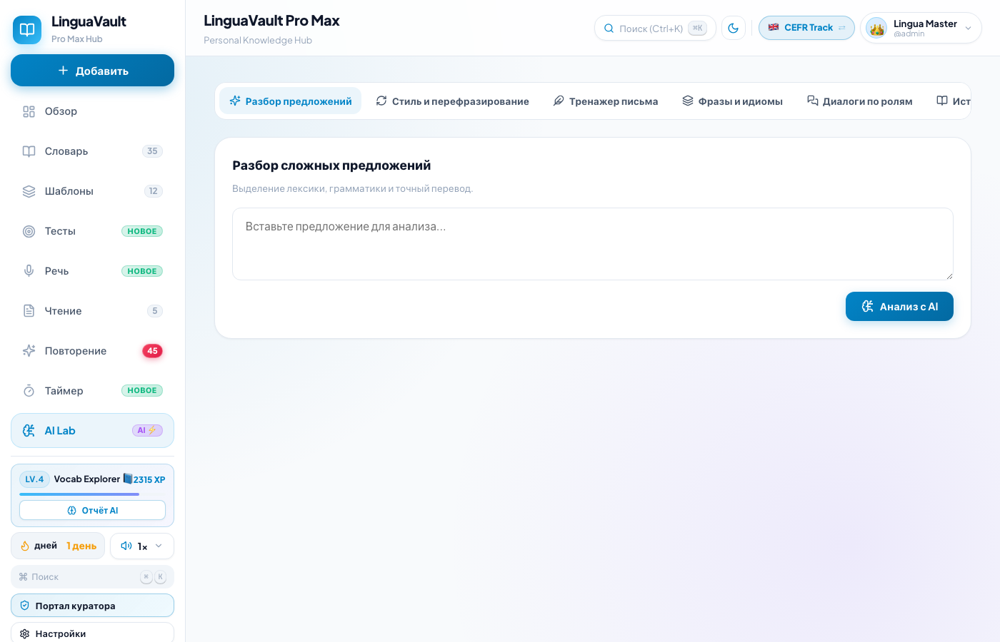

# 🌸 Cẩm Nang Hướng Dẫn Sử Dụng LinguaVault V2 (Chi Tiết Toàn Diện)

> Chào bạn! Đây là bản hướng dẫn sử dụng chi tiết nhất dành cho người học. Tài liệu này sẽ giải thích cặn kẽ **tất cả 15 phân hệ**, **từng tab con**, **các nút bấm** và **bí quyết học tập hiệu quả** để bạn hoặc Lena làm chủ ứng dụng một cách dễ dàng và thoải mái nhất.

---

## 📑 Mục Lục Hướng Dẫn
1. [Đăng Nhập & Chọn Ngôn Ngữ Giao Diện](#1-đăng-nhập--chọn-ngôn-ngữ-giao-diện)
2. [Bảng Điều Khiển (Dashboard) — La Bàn Học Tập Mỗi Ngày](#2-bảng-điều-khiển-dashboard--la-bàn-học-tập-mỗi-ngày)
3. [Kho Từ Vựng (Vocab Vault) — Các Tab Lọc & Thêm Từ Nhanh](#3-kho-từ-vựng-vocab-vault--các-tab-lọc--thêm-từ-nhanh)
4. [Kho Mẫu Câu (Sentence Patterns) — 7 Nhóm Cấu Trúc Ngữ Pháp](#4-kho-mẫu-câu-sentence-patterns--7-nhóm-cấu-trúc-ngữ-pháp)
5. [Trung Tâm Ôn Tập Ngắt Quãng (SRS Review) — Thuật Toán SM-2 & 4 Nút Đánh Giá](#5-trung-tâm-ôn-tập-ngắt-quãng-srs-review--thuật-toán-sm-2--4-nút-đánh-giá)
6. [Trung Tâm Thi Trắc Nghiệm (Quiz Center) — 5 Chế Độ Luyện Tập](#6-trung-tâm-thi-trắc-nghiệm-quiz-center--5-chế-độ-luyện-tập)
7. [Phòng Luyện Nói (Speaking Lab) — 3 Chế Độ Luyện Khẩu Hình & Phản Xạ](#7-phòng-luyện-nói-speaking-lab--3-chế-độ-luyện-khẩu-hình--phản-xạ)
8. [Đọc Bài Thông Minh (Smart Reader) — Tra Từ 1 Chạm & Nghe Đọc Từng Câu](#8-đọc-bài-thông-minh-smart-reader--tra-từ-1-chạm--nghe-đọc-từng-câu)
9. [Phòng Thí Nghiệm AI (AI Lab) — Dệt Truyện Ký Ức & Mẹo Ghi Nhớ](#9-phòng-thí-nghiệm-ai-ai-lab--dệt-truyện-ký-ức--mẹo-ghi-nhớ)
10. [Đồng Hồ Học Tập & Kỷ Luật (Study Timer Hub) — Pomodoro & Lập Lịch](#10-đồng-hồ-học-tập--kỷ-luật-study-timer-hub--pomodoro--lập-lịch)
11. [Lộ Trình Kép Song Song (CEFR Tiếng Anh ⇄ VSL Tiếng Việt)](#11-lộ-trình-kép-song-song-cefr-tiếng-anh--vsl-tiếng-việt)
12. [Bảng Điều Khiển Tốc Độ & Giọng Đọc Âm Thanh (Audio Speed Popover)](#12-bảng-điều-khiển-tốc-độ--giọng-đọc-âm-thanh-audio-speed-popover)
13. [Hồ Sơ Cá Nhân & Báo Cáo Năng Lực AI (Profile & Gamification)](#13-hồ-sơ-cá-nhân--báo-cáo-năng-lực-ai-profile--gamification)
14. [Cổng Giám Sát Học Tập Công Khai (Supervisor / Public Stats)](#14-cổng-giám-sát-học-tập-công-khai-supervisor--public-stats)
15. [Phím Tắt Nhanh (⌘K) & Sao Lưu Dữ Liệu An Toàn (Backup & Restore)](#15-phím-tắt-nhanh-k--sao-lưu-dữ-liệu-an-toàn-backup--restore)

---

## 1. Đăng Nhập & Chọn Ngôn Ngữ Giao Diện

Màn hình đầu tiên khi mở ứng dụng:

### Thao tác từng bước:
1. **Chọn ngôn ngữ giao diện:** Ở góc trên bên phải, bấm vào lá cờ:
   * 🇻🇳 **Tiếng Việt**
   * 🇷🇺 **Русский (Tiếng Nga)**
   * 🇬🇧 **English (Tiếng Anh)**
   Toàn bộ chữ, nút bấm và hướng dẫn trên web sẽ lập tức chuyển sang ngôn ngữ bạn chọn.
2. **Nhập tài khoản:**
   * **Tên đăng nhập:** `admin` (hoặc tên tài khoản của bạn).
   * **Mật khẩu:** `123456`.
3. Bấm nút **«Đăng Nhập» (Sign In / Войти)**.
4. *Mẹo:* Bấm nút «Lưu mật khẩu» trên trình duyệt để những lần sau vào học chỉ mất 1 giây.

---

## 2. Bảng Điều Khiển (Dashboard) — La Bàn Học Tập Mỗi Ngày

Giao diện trang chủ cho bạn cái nhìn tổng quan về khối lượng bài học hôm nay.

### Chi tiết các khối thông tin:
* **🔥 Chuỗi ngày liên tiếp (Streak):** Số ngày bạn học liên tục không nghỉ. Hãy duy trì mỗi ngày 5–10 phút để giữ ngọn lửa thắp sáng!
* **📚 Cần ôn hôm nay (Due Today):** Số lượng thẻ từ vựng đã đến lúc não bộ bắt đầu quên theo đường cong Ebbinghaus. Bấm nút to **«Bắt đầu ôn tập»** để ôn ngay!
* **📖 Tổng từ vựng (Total Words):** Quy mô kho từ vựng bạn đã tích lũy.
* **🏆 Đã thành thạo (Mastered):** Những từ đã qua mốc 21 ngày nhớ sâu, thuộc lòng vĩnh viễn.
* **⭐ Cấp độ & Điểm kinh nghiệm (XP):** Mỗi lần lật thẻ được `+10 XP`, làm bài test được `+25 XP`, luyện nói được `+15 XP`. Càng học nhiều cấp bậc càng tăng (*Novice ➔ Explorer ➔ Master*).
* **📈 Biểu đồ lịch sử học tập (Activity History Chart):** Cột biểu đồ 7 ngày và 30 ngày. Rê chuột vào từng cột để xem ngày học, số từ và số phút học thực tế.
* **📝 Danh sách từ gần đây (Recent Words):** Các từ bạn vừa xem, có nút loa 🔊 bấm nghe phát âm tức thì.

---

## 3. Kho Từ Vựng (Vocab Vault) — Các Tab Lọc & Thêm Từ Nhanh

Nơi quản lý toàn bộ gia tài từ vựng của bạn.

### 5 Tab lọc theo trạng thái ghi nhớ:
* **Tất cả (All):** Toàn bộ từ vựng không giới hạn.
* **Cần ôn tập (Due):** Chỉ lọc ra các từ cần ôn hôm nay.
* **Đang học (Learning):** Các từ mới học dưới 3 tuần.
* **Thành thạo (Mastered):** Các từ đã thuộc sâu.
* **Yêu thích (Starred ⭐):** Những từ bạn đánh dấu sao để chú ý đặc biệt.

### Các bộ lọc thông minh:
* **Lọc theo chủ đề (Topics):** Chọn nhanh 16 nhóm: *Đời sống thường ngày, Gia đình, Ẩm thực, Du lịch, Công việc, Giáo dục, Sức khỏe, Nghệ thuật, Thể thao, Mua sắm, Kinh doanh, Tài chính, Thiên nhiên, Khoa học, Công nghệ...*
* **Lọc theo từ loại (POS):** Danh từ, Động từ, Tính từ, Trạng từ, Thành ngữ.
* **Thanh tìm kiếm:** Gõ chữ bất kỳ để tìm từ theo cả tiếng Anh, tiếng Nga và tiếng Việt.

### Cửa sổ thêm từ mới (`+` Quick Add Modal):
* **Tab 1 — Mặt trước (Front):** Nhập từ khóa, bấm kính lúp để hệ thống **tự động tra từ điển** điền phiên âm IPA, chọn từ loại, cấp độ (A1-C2 hoặc VSL 1-6) và chủ đề.
* **Tab 2 — Mặt sau (Back):** Điền giải nghĩa tiếng Việt, tiếng Nga, câu ví dụ ngữ cảnh, bản dịch câu và ghi chú mẹo nhớ của riêng bạn.

---

## 4. Kho Mẫu Câu (Sentence Patterns) — 7 Nhóm Cấu Trúc Ngữ Pháp

Giúp bạn không chỉ học từ rời rạc mà biết cách ghép thành câu văn chuẩn xác, tự nhiên.

### 7 Nhóm danh mục mẫu câu:
1. **⚡ Nguyên nhân & Kết quả (Cause & Effect):** Các cấu trúc *Due to + Noun, Because of, As a result, Lead to*.
2. **⚖️ Tương phản & Nhượng bộ (Contrast & Concession):** Cấu trúc *Although, Despite + Noun, In contrast, However*.
3. **❓ Điều kiện & Giả định (Condition & Hypothesis):** Cấu trúc *Unless, Provided that, In case*.
4. **🎯 Mục đích (Purpose & Goal):** Cấu trúc *In order to + Verb, So that, With a view to*.
5. **📏 So sánh (Comparison):** Cấu trúc *As... as, Compared with*.
6. **⏳ Thời gian & Trình tự (Time & Sequence):** Cấu trúc *Prior to, Subsequently, Meanwhile*.
7. **➕ Bổ sung & Nhấn mạnh (Addition & Emphasis):** Cấu trúc *Furthermore, Not only... but also*.

### Trong mỗi thẻ mẫu câu:
* Công thức cấu trúc ngữ pháp rõ ràng.
* Giải thích ngắn gọn cách dùng và sắc thái ý nghĩa.
* 3–5 câu ví dụ thực tế kèm bản dịch và nút loa phát âm.

---

## 5. Trung Tâm Ôn Tập Ngắt Quãng (SRS Review) — Thuật Toán SM-2 & 4 Nút Đánh Giá

Trái tim của hệ thống ghi nhớ vĩnh viễn bằng thuật toán **SuperMemo SM-2**.

### Quy trình ôn tập:
1. **Mặt trước thẻ:** Xuất hiện từ vựng to rõ và câu ví dụ bị ẩn từ khóa. Bạn tự nhẩm lại nghĩa trong đầu.
2. **Bấm «Hiện đáp án» (Phím Space):** Thẻ lật ra mặt sau, giọng đọc phát âm chuẩn vang lên, hiện đầy đủ nghĩa, ví dụ, từ đồng nghĩa.
3. **Bấm chọn 1 trong 4 nút đánh giá:**
   * 🔴 **Снова (Again - Phím 1):** Quên từ ➔ Thẻ sẽ quay lại ở cuối phiên học hôm nay.
   * 🟠 **Трудно (Hard - Phím 2):** Nhớ khó khăn, mất nhiều thời gian ➔ Khoảng cách ôn tăng nhẹ (1–2 ngày).
   * 🟢 **Хорошо (Good - Phím 3):** Nhớ tốt, phản xạ tự nhiên (Nút bấm thường xuyên nhất) ➔ Khoảng cách nhân lên 2.5 lần.
   * 🔵 **Легко (Easy - Phím 4):** Quá dễ, thuộc lòng ➔ Khoảng cách nhảy vọt vài tuần hoặc vài tháng.
4. *Mẹo phím tắt:* Bạn có thể bấm phím `1`, `2`, `3`, `4` trên bàn phím để chấm điểm cực nhanh!
5. **Màn hình tổng kết (Summary):** Báo cáo số thẻ đã học, số điểm XP nhận được và dự báo thời gian đợt ôn kế tiếp.

---

## 6. Trung Tâm Thi Trắc Nghiệm (Quiz Center) — 5 Chế Độ Luyện Tập

Biến việc kiểm tra kiến thức thành trò chơi hào hứng.

### 5 Chế độ bài tập:
1. **Chế độ 1 — Trắc nghiệm 4 đáp án (Multiple Choice):** Cho từ vựng, chọn 1 trong 4 nghĩa đúng trong 15 giây.
2. **Chế độ 2 — Điền từ vào chỗ trống (Fill in the Blank):** Cho câu thiếu từ `____`, chọn từ điền vào hoặc tự gõ. Có nút bóng đèn 💡 gợi ý chữ cái đầu.
3. **Chế độ 3 — Thử thách nghe (Listening Challenge):** Không có chữ hiển thị, chỉ bấm loa nghe âm thanh và chọn từ đúng trên màn hình.
4. **Chế độ 4 — Nối ngữ cảnh (Context Matching):** Chọn ngữ cảnh đời sống phù hợp nhất với từ (trang trọng, thân mật, học thuật, thương mại).
5. **Chế độ 5 — Đề thi thích ứng AI (AI Adaptive Quiz):** AI tự động gom những từ bạn hay làm sai để tạo thành một đề thi cá nhân hóa kèm phân tích lỗi sai chi tiết!

---

## 7. Phòng Luyện Nói (Speaking Lab) — 3 Chế Độ Luyện Khẩu Hình & Phản Xạ

Phá vỡ rào cản sợ nói, tự tin phát âm chuẩn bản ngữ.

### 3 Chế độ luyện nói:
1. **Chế độ 1 — Đọc thành tiếng (Read Aloud):**
   * Đoạn văn mẫu kèm phiên âm.
   * **Hộp Mẹo phát âm (Pronunciation Tips):** Hướng dẫn bằng tiếng Nga/Việt cách đặt đầu lưỡi, uốn khẩu hình và đánh trọng âm.
   * Bấm nút micro tròn 🎙️ để đọc ➔ Sóng âm nhảy theo giọng nói của bạn ➔ Bấm dừng.
   * AI chấm điểm theo 3 thang: *Độ chính xác (Accuracy), Độ lưu loát (Fluency), Độ trọn vẹn (Completeness)* và tô màu từng từ (*Xanh = chuẩn, Vàng = hơi lệch, Đỏ = sai*).
2. **Chế độ 2 — Hỏi & Đáp phản xạ (Q&A):**
   * Câu hỏi thực tế từ máy tính.
   * **Hộp Gợi ý ý tưởng (Ideas hint):** Gợi ý từ vựng và ý tưởng trả lời.
   * Thu âm câu trả lời tự do trong 60 giây.
3. **Chế độ 3 — Luyện câu tự do (Custom Practice):**
   * Dán bất kỳ câu nào bạn thích, nghe giọng đọc mẫu và bấm mic tập nói theo.

---

## 8. Đọc Bài Thông Minh (Smart Reader) — Tra Từ 1 Chạm & Nghe Đọc Từng Câu

Đọc báo, truyện thực tế mà không cần lật từ điển bên ngoài.

### Các tính năng tuyệt vời:
* **Thư viện bài đọc:** Các bài báo, mẩu chuyện phân cấp theo trình độ (A1 đến C1).
* **Tra từ 1 chạm:** Chạm vào bất kỳ từ nào bạn chưa hiểu ➔ Ngay trên đầu từ sẽ hiện popup dịch nghĩa, phiên âm và nút **`+ Thêm vào kho từ`**.
* **Nghe đọc từng câu:** Mỗi câu văn đều có biểu tượng loa 🔊 riêng để nghe диктор đọc với ngữ điệu tự nhiên trong trẻo.
* **Tự động bôi đậm từ đang học:** Những từ nằm trong Flashcard của bạn sẽ tự động được tô đậm trong bài đọc giúp tăng khả năng nhận diện từ trong thực tế.
* **Tự thêm bài viết:** Nút dán bài viết mới cho phép bạn đưa bất kỳ câu chuyện hay tài liệu nào của riêng mình vào đọc.

---

## 9. Phòng Thí Nghiệm AI (AI Lab) — Dệt Truyện Ký Ức & Mẹo Ghi Nhớ

Ứng dụng trí tuệ nhân tạo **Google Gemini AI** giúp ghi nhớ siêu tốc.

### 2 Tab công cụ AI:
1. **Tab 1 — Spaced Memory Story (Dệt truyện ghi nhớ):**
   * Ứng dụng tự động chọn ra những từ bạn đang thấy khó nhớ nhất.
   * Bấm nút **«Tạo câu chuyện»**.
   * AI sẽ viết một câu chuyện ngắn hài hước/kỳ thú lồng ghép khéo léo tất cả các từ này in đậm. Não bộ ghi nhớ câu chuyện nhanh gấp 5 lần so với học từ đơn lẻ!
   * Có thể đọc truyện có dịch nghĩa và bấm loa nghe диктор đọc toàn bộ câu chuyện.
2. **Tab 2 — Memory Weaver (Thợ dệt liên tưởng):**
   * Gõ từ khó nhớ vào ô tìm kiếm.
   * AI tạo ra 3 mẹo nhớ độc đáo: Thơ vần ngắn, Hình ảnh tưởng tượng kỳ lạ, Cầu nối ngữ âm đồng âm.

---

## 10. Đồng Hồ Học Tập & Kỷ Luật (Study Timer Hub) — Pomodoro & Lập Lịch

Duy trì sự tập trung cao độ và xây dựng thói quen học mỗi ngày.

### 4 Tab chức năng:
1. **Tab Pomodoro:** Chu kỳ chuẩn 25 phút học tập trung cao độ + 5 phút nghỉ ngắn. Có chuông báo khi hết giờ.
2. **Tab Stopwatch (Bấm giờ):** Bấm giờ tự do để theo dõi thời gian học thực tế.
3. **Tab Schedule & Alarm (Lập lịch & Báo thức):**
   * Cài đặt khung giờ học cố định trong ngày (ví dụ 08:30 sáng).
   * **Chế độ Kỷ luật (Hardcore Discipline Mode):** Tự động phát chuông cảnh báo trước nửa đêm nếu mục tiêu ngày chưa hoàn thành, bảo vệ chuỗi ngày Streak không bị đứt.
4. **Tab Study Logs (Nhật ký học):** Thống kê chi tiết số phút và số giờ bạn đã học theo tuần/tháng.

---

## 11. Lộ Trình Kép Song Song (CEFR Tiếng Anh ⇄ VSL Tiếng Việt)

Hỗ trợ học song song cả 2 ngôn ngữ trên cùng 1 tài khoản duy nhất.

Ở thanh Header trên cùng có nút chuyển đổi:
* 🇬🇧 **Track Tiếng Anh (CEFR Track):** 6 cấp độ chuẩn Châu Âu (*A1 Sơ cấp, A2 Cơ bản, B1 Trung cấp, B2 Trung cao, C1 Cao cấp, C2 Thành thạo*).
* 🇻🇳 **Track Tiếng Việt (VSL Track):** 6 bậc chuẩn quốc gia (*Bậc 1–2 Sơ cấp, Bậc 3–4 Trung cấp, Bậc 5–6 Cao cấp*).

Chỉ cần bấm 1 chạm, toàn bộ từ vựng, ngữ pháp, bài tập và giọng đọc sẽ tự động đổi theo ngôn ngữ tương ứng!

---

## 12. Bảng Điều Khiển Tốc Độ & Giọng Đọc Âm Thanh (Audio Speed Popover)

Nút bấm `1x` nổi ở góc trái bên dưới.

* **Thanh trượt tốc độ:** Tăng giảm từ **0.5x đến 1.5x** (người mới nên để `0.8x` để nghe rõ từng âm tiết).
* **Nút bấm nhanh:** `0.75x`, `1.0x`, `1.25x`, `1.5x`.
* **Chọn chất giọng:**
  * 🇺🇸 Tiếng Anh - Mỹ (en-US)
  * 🇬🇧 Tiếng Anh - Anh (en-GB)
  * 🇻🇳 Tiếng Việt giọng Bắc chuẩn (vi-VN)
* **Nút nghe thử:** Bấm nút tròn màu xanh để nghe thử câu mẫu với tốc độ vừa chọn.

---

## 13. Hồ Sơ Cá Nhân & Báo Cáo Năng Lực AI (Profile & Gamification)

* **Hồ sơ cá nhân:**
  * Tab «Thông tin»: Chọn Avatar Emoji (👑, 🦁, 🌸, 🚀), đổi họ tên và biệt danh hiển thị.
  * Tab «Ngôn ngữ»: Chọn tiếng mẹ đẻ (Tiếng Nga) và ngôn ngữ mục tiêu (Tiếng Anh/Tiếng Việt).
* **Cấp bậc danh hiệu:** Tích lũy XP để thăng hạng qua từng bậc học giả.
* **AI Mastery Report:** Báo cáo biểu đồ mạng nhện (radar chart) do AI phân tích 5 kỹ năng: *Vốn từ, Khả năng ghi nhớ, Phát âm, Ngữ pháp, Tốc độ đọc*.

---

## 14. Cổng Giám Sát Học Tập Công Khai (Supervisor / Public Stats)

* Đường dẫn xem trực tiếp: `/giam-sat` hoặc `/public/stats`.
* Dành cho giáo viên, phụ huynh hoặc bạn bè xem thành tích học (số từ đã thuộc, chuỗi ngày Streak, biểu đồ chăm chỉ) một cách đẹp mắt mà không cần đăng nhập hay sửa đổi dữ liệu.

---

## 15. Phím Tắt Nhanh (⌘K) & Sao Lưu Dữ Liệu An Toàn (Backup & Restore)

* **Thanh tìm kiếm siêu tốc (Command Palette):**
  * Nhấn `Ctrl + K` (Windows) hoặc `Cmd + K` (Mac) ở bất cứ đâu để nhảy nhanh đến mọi phân hệ hoặc đổi giao diện **Sáng / Tối (Light/Dark)**.
* **Sao lưu dữ liệu (Backup):** Bấm 1 nút để tải file `lingua_vault_backup.json` về máy tính cất giữ.
* **Khôi phục dữ liệu (Restore):** Nạp lại dữ liệu trong 1 giây khi đổi điện thoại hoặc máy tính mới.

---

🌸 **Chúc bạn và Lena có những giờ phút học tập tràn đầy cảm hứng và tiến bộ vượt bậc cùng LinguaVault V2!**
