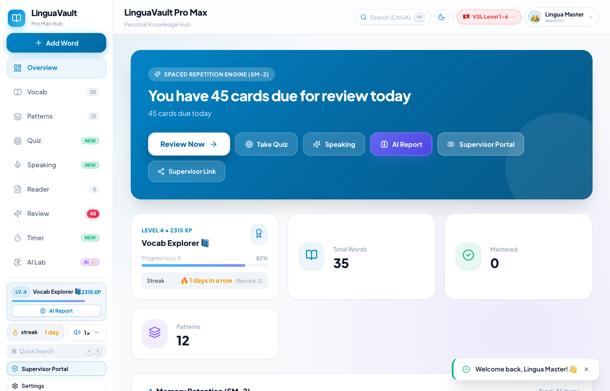

# 🌸 Полное руководство пользователя LinguaVault: все разделы и подвкладки

Привет! В этом подробном руководстве подробно и просто описаны **все 15 разделов** приложения и **каждая их подвкладка (режим работы)**. Ты легко сможешь найти нужную функцию и использовать все возможности для интересного и эффективного обучения.

---

## 📑 Содержание разделов
1. [📊 Главная панель (Dashboard)](#1--главная-панель-dashboard)
2. [📚 Словарь (Vocab Vault) — все фильтры и вкладки](#2--словарь-vocab-vault--все-фильтры-и-вкладки)
3. [🧩 Хранилище грамматических конструкций (Sentence Patterns)](#3--хранилище-грамматических-конструкций-sentence-patterns)
4. [🧠 Центр интервального повторения карточек (SRS Review)](#4--центр-интервального-повторения-карточек-srs-review)
5. [🎯 Центр тестирования (Quiz Center) — 5 режимов квизов](#5--центр-тестирования-quiz-center--5-режимов-квизов)
6. [🎙️ Лаборатория речи (Speaking Lab) — 3 режима практики](#6--лаборатория-речи-speaking-lab--3-режима-практики)
7. [📖 Умное чтение (Smart Reader) — библиотека и интерактивный ридер](#7--умное-чтение-smart-reader--библиотека-и-интерактивный-ридер)
8. [🤖 AI Лаборатория (AI Lab) — истории и мнемоника](#8--ai-лаборатория-ai-lab--истории-и-мнемоника)
9. [⏱️ Таймер обучения (Study Timer Hub) — Pomodoro и расписание](#9--таймер-обучения-study-timer-hub--pomodoro-и-расписание)
10. [🔀 Двойной образовательный трек (CEFR Английский ⇄ VSL Вьетнамский)](#10--двойной-образовательный-трек-cefr-английский--vsl-вьетнамский)
11. [🔊 Панель скорости и акцента диктора (Audio Speed Popover)](#11--панель-скорости-и-акцента-диктора-audio-speed-popover)
12. [👤 Профиль, уровни и отчет мастерства (Profile & Gamification)](#12--профиль-уровни-и-отчет-мастерства-profile--gamification)
13. [👁️ Публичный портал куратора (Supervisor / Public Stats)](#13--публичный-портал-куратора-supervisor--public-stats)
14. [⌨️ Командная строка быстрого поиска (Command Palette ⌘K)](#14--командная-строка-быстрого-поиска-command-palette-k)
15. [💾 Настройки и резервное копирование (Settings & Backup)](#15--настройки-и-резервное-копирование-settings--backup)

---

## 1. 📊 Главная панель (Dashboard)

Главный экран встречает тебя каждый день и наглядно показывает твой прогресс.

### Подблоки и элементы экрана:
* **🔥 Серия дней (Streak):** индикатор непрерывных дней занятий. Заходи каждый день хотя бы на 5 минут!
* **📚 Карточка «К повторению» (Due Today):** количество слов, готовых к интервальному повторению сегодня.
* **📖 Карточка «Всего в словаре» (Total Words):** общее число слов в твоей личной базе.
* **🏆 Карточка «Освоено» (Mastered):** слова, которые прочно закрепились в долговременной памяти.
* **⭐ Уровень и Опыт (XP Level):** шкала опыта, отображающая твой текущий уровень (от *Novice* до *Master*).
* **🚀 Кнопка «Начать повторение»:** быстрый запуск сегодняшней тренировки в один клик.
* **📈 График активности (Activity History Chart):** наглядная диаграмма с историей повторений и затраченным временем по дням недели.
* **📝 Список «Недавние слова» (Recent Words):** последние добавленные или повторенные слова с кнопками мгновенной озвучки.

---

## 2. 📚 Словарь (Vocab Vault) — все фильтры и вкладки

Здесь хранится вся твоя персональная коллекция слов.

### Подвкладки фильтрации по статусу:
* **Все слова (All):** полный список всех слов без ограничений.
* **Требуют повторения (Due / Needs Review):** только слова, подошедшие к сроку повторения по алгоритму.
* **В процессе (Learning):** слова, которые ты учишь прямо сейчас.
* **Освоены (Mastered):** слова с длинными интервалами, которые ты отлично знаешь.
* **Избранное (Starred):** слова, отмеченные тобой звёздочкой для особого внимания.

### Фильтры и инструменты:
* **Выпадающий список тем (Topics):** выбор категории слов (*Повседневная жизнь, Путешествия, Еда и рестораны, Работа и карьера, Здоровье, Искусство, Природа, Бизнес*).
* **Фильтр по частям речи (POS):** отображение только существительных, глаголов, прилагательных, наречий или устойчивых фраз.
* **Поисковая строка:** мгновенный поиск слова по буквам на любом языке.
* **Кнопка динамика 🔊:** прослушивание правильного произношения у каждого слова.

### Всплывающее окно добавления слова («+» Quick Add Modal):
* **Вкладка 1 — Лицевая сторона (Front):** ввод слова, автоматический подбор транскрипции IPA, выбор части речи и темы.
* **Вкладка 2 — Оборотная сторона (Back):** перевод на русский, вьетнамский и английский языки, контекстный пример предложения и твои личные заметки.

---

## 3. 🧩 Хранилище грамматических конструкций (Sentence Patterns)

Раздел для освоения шаблонов предложений и грамматических связок в живом контексте.

### Подкатегории конструкций:
* **⚡ Причина и следствие (Cause & Effect):** конструкции выражения причинности (*Due to, Because of, As a result, Lead to*).
* **⚖️ Контраст и уступка (Contrast & Concession):** противопоставления (*Although, Despite, In contrast, However*).
* **❓ Условие и гипотеза (Condition & Hypothesis):** условные конструкции (*Provided that, Unless, In case*).
* **🎯 Цель (Purpose & Goal):** выражение целей (*In order to, So that, With a view to*).
* **📏 Сравнение (Comparison):** сравнительные обороты (*As... as, Compared to*).
* **⏳ Время и последовательность (Time & Sequence):** временные маркеры (*Prior to, Subsequently*).
* **➕ Дополнение и акцент (Addition & Emphasis):** связки дополнения (*Furthermore, Not only... but also*).

### Карточка конструкции:
* Формула построения предложения.
* Понятное объяснение грамматического правила.
* 3–5 примеров употребления с переводом и кнопкой озвучки.

---

## 4. 🧠 Центр интервального повторения карточек (SRS Review)

Главный инструмент долговременного запоминания на основе научного алгоритма **SuperMemo SM-2**.

### Шаги тренировки:
1. **Лицевая сторона:** показывается только слово на изучаемом языке. Ты вспоминаешь его про себя.
2. **Кнопка «Показать ответ»:** карточка плавно переворачивается.
3. **Оборотная сторона:** звучит диктор, открывается перевод, транскрипция, пример предложения и синонимы.
4. **4 кнопки оценки памяти:**
   * 🔴 **Снова (Again):** не вспомнила. Слово вернется в конец этой же сессии.
   * 🟠 **Трудно (Hard):** вспомнила с большим трудом. Интервал вырастет минимально.
   * 🟢 **Хорошо (Good):** нормальный, уверенный ответ (наиболее частый выбор).
   * 🔵 **Легко (Easy):** знаешь назубок. Интервал повторения сразу увеличится на несколько недель.

### Экран завершения сессии (Session Summary):
* Количество успешно повторенных слов.
* Начисленные баллы опыта (XP).
* Время, когда появятся следующие карточки для повторения.

---

## 5. 🎯 Центр тестирования (Quiz Center) — 5 режимов квизов

Раздел для увлекательной проверки знаний в игровом формате.

### 5 режимов тестирования (Подвкладки):
1. **Режим 1 — Множественный выбор (Multiple Choice):** выбор правильного перевода из 4 вариантов ответов за ограниченное время.
2. **Режим 2 — Заполнение пропусков (Fill in the Blank):** вставка пропущенного слова в контекстное предложение.
3. **Режим 3 — Аудирование (Listening Challenge):** слуховое восприятие — диктор произносит слово, а ты выбираешь правильный вариант на слух.
4. **Режим 4 — Подбор контекста (Context Matching):** сопоставление слова с наиболее подходящей жизненной ситуацией.
5. **Режим 5 — Адаптивный AI Квиз (AI Adaptive Quiz):** искусственный интеллект анализирует слова, в которых ты чаще всего ошибаешься, и формирует персональный проверочный тест!

---

## 6. 🎙️ Лаборатория речи (Speaking Lab) — 3 режима практики

Интерактивный тренажер разговорной речи с обратной связью по микрофону.

### 3 режима практики:
1. **Режим «Чтение вслух» (Read Aloud):**
   * Образцовый текст и транскрипция.
   * Блок **💡 «Советы по произношению» (Pronunciation Tips)** на русском языке: подсказки по сложным звукам, интонации и ударению.
   * Запись через микрофон с живой визуализацией звуковой волны.
   * Оценка качества произношения в баллах (*Точность, Беглость, Полнота*).
2. **Режим «Вопрос и ответ» (Q&A):**
   * Спонтанный ответ на жизненные вопросы.
   * Блок **💡 «Подсказка идей» (Ideas hint):** ключевые мысли, которые помогут сформулировать ответ.
3. **Режим «Свободная тренировка» (Custom Mode):**
   * Введи абсолютно любое предложение, которое хочешь отработать, и тренируй его произношение с искусственным интеллектом.

---

## 7. 📖 Умное чтение (Smart Reader) — библиотека и интерактивный ридер

Чтение адаптированных статей и историй с умной поддержкой.

### Возможности модуля:
* **Библиотека статей:** каталог текстов, разбитых по уровням сложности (от начального до продвинутого).
* **Интерактивный перевод по клику:** нажми на любое слово прямо в тексте — мгновенно появится всплывающее окно с переводом, транскрипцией и кнопкой добавления в твой личный словарь.
* **Построчная озвучка:** значок динамика рядом с каждым предложением воспроизводит речь диктора с чистым звуком.
* **Подсветка изучаемых слов:** слова из твоих карточек повторения мягко подсвечены в тексте, помогая узнавать их в реальной речи.
* **Добавление своих текстов:** кнопка «Добавить статью», позволяющая вставить любой интересный тебе текст или главу книги.

---

## 8. 🤖 AI Лаборатория (AI Lab) — истории и мнемоника

Мощный модуль обучения с поддержкой **Google Gemini AI**.

### 2 подвкладки:
1. **Вкладка 1 — Spaced Memory Story (Истории памяти):**
   * Выбери слова, которые трудно запоминаются.
   * Нажми кнопку генерации — искусственный интеллект напишет увлекательный, живой рассказ, гармонично объединяющий эти слова в один сюжет.
   * Историю можно читать с переводом и слушать целиком в исполнении диктора.
2. **Вкладка 2 — Memory Weaver (Ткач ассоциаций):**
   * Создание мнемонических зацепок, рифм, ярких ассоциаций и визуальных образов для сложных терминов.

---

## 9. ⏱️ Таймер обучения (Study Timer Hub) — Pomodoro и расписание

Инструмент поддержания фокуса и здорового темпа занятий без усталости.

### 4 подвкладки:
1. **Вкладка Pomodoro:** классический цикл: 25 минут сфокусированной учебы ➔ 5 минут короткого отдыха ➔ длинный отдых после 4 циклов.
2. **Вкладка «Секундомер» (Stopwatch):** свободный подсчет времени занятия.
3. **Вкладка «Расписание и напоминания» (Schedule & Alarms):** настройка времени ежедневных занятий и умного будильника дисциплины (Hardcore Discipline Mode), защищающего серию дней.
4. **Вкладка «Журнал продуктивности» (Study Logs):** точная история минут и часов, проведенных за учебой за неделю и месяц.

---

## 10. 🔀 Двойной образовательный трек (CEFR Английский ⇄ VSL Вьетнамский)

LinguaVault V2 поддерживает одновременное обучение двум языкам с независимыми базами знаний.

В верхней панели (Header) расположен переключатель:
* 🇬🇧 **CEFR Track (A1 – C2):** международная европейская программа изучения английского языка.
* 🇻🇳 **VSL Bậc 1–6 (Уровни 1 – 6):** государственный стандарт Вьетнама по преподаванию вьетнамского языка как иностранного.

При переключении трека меняются словарь, темы, грамматические категории и произношение, сохраняя весь твой прогресс.

---

## 11. 🔊 Панель скорости и акцента диктора (Audio Speed Popover)

Всплывающая панель настройки звучания речи (кнопка `1x` в левом нижнем углу).

* **Плавный ползунок скорости:** от 0.5x до 1.5x (для комфортного разбора речи идеальна скорость `0.8x – 0.9x`).
* **Пресеты:** кнопки мгновенного переключения `0.75x`, `1.0x`, `1.25x`, `1.5x`.
* **Выбор акцента:** Американский (🇺🇸 en-US), Британский (🇬🇧 en-GB) или Вьетнамский (🇻🇳 vi-VN).
* **Кнопка проверки:** прослушивание контрольной фразы с выбранной скоростью в один клик.

---

## 12. 👤 Профиль, уровни и отчет мастерства (Profile & Gamification)

* **Окно редактирования профиля (Profile Modal):**
  * Вкладка «Данные»: выбор emoji-аватарки, имени и отображаемого ника.
  * Вкладка «Языковые предпочтения»: выбор родного языка (Русский) и целевого языка обучения.
* **Бейдж уровня:** текущий ранг (*Novice Scholar, Vocab Explorer, Language Master*).
* **AI Mastery Report:** всплывающий отчет искусственного интеллекта с анализом словарного запаса и персональными рекомендациями.

---

## 13. 👁️ Публичный портал куратора (Supervisor / Public Stats)

* Доступ по ссылке: `/giam-sat` или `/public/stats`.
* Позволяет преподавателю, наставнику или друзьям в реальном времени смотреть твою статистику (серия дней, выученные слова, время занятий) без необходимости входа под твоим логином.

---

## 14. ⌨️ Командная строка быстрого поиска (Command Palette ⌘K)

* Нажми `Ctrl + K` (на Windows) или `Cmd + K` (на Mac) в любом месте приложения.
* Появится окно быстрого поиска: мгновенный переход в любой раздел, добавление слова или смена темы оформления (**Светлая / Тёмная**).

---

## 15. 💾 Настройки и резервное копирование (Settings & Backup)

* **Экспорт данных (Backup):** скачивание файла `lingua_vault_backup.json` на компьютер. Все слова и история повторений будут сохранены.
* **Импорт данных (Restore):** восстановление базы в один клик при смене устройства.
* **Выбор темы и языка:** переключение интерфейса между русским, вьетнамским и английским.

---

🌸 **Приятной и вдохновляющей учёбы с LinguaVault V2!**
