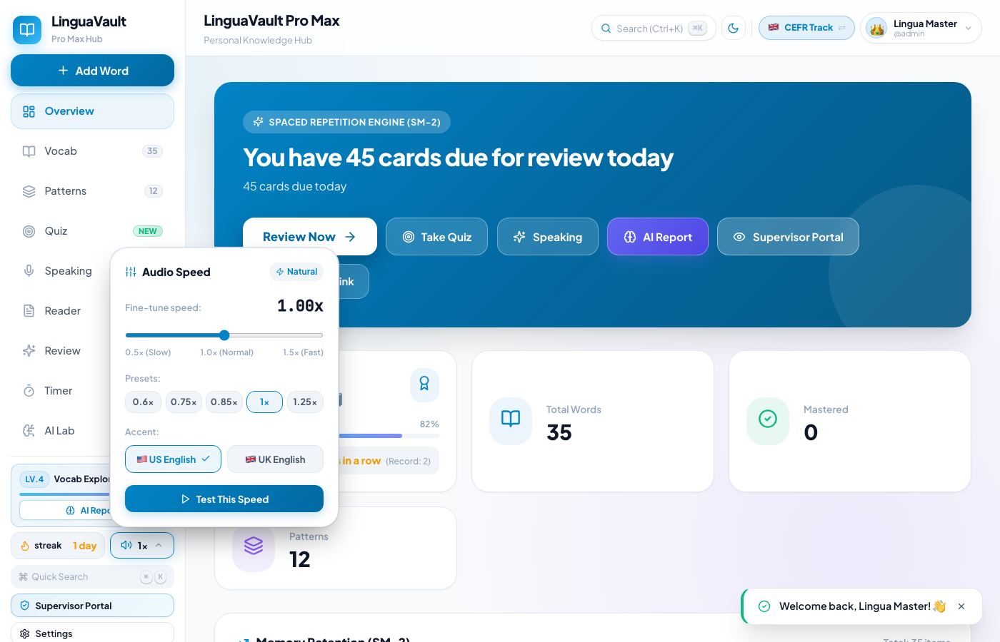
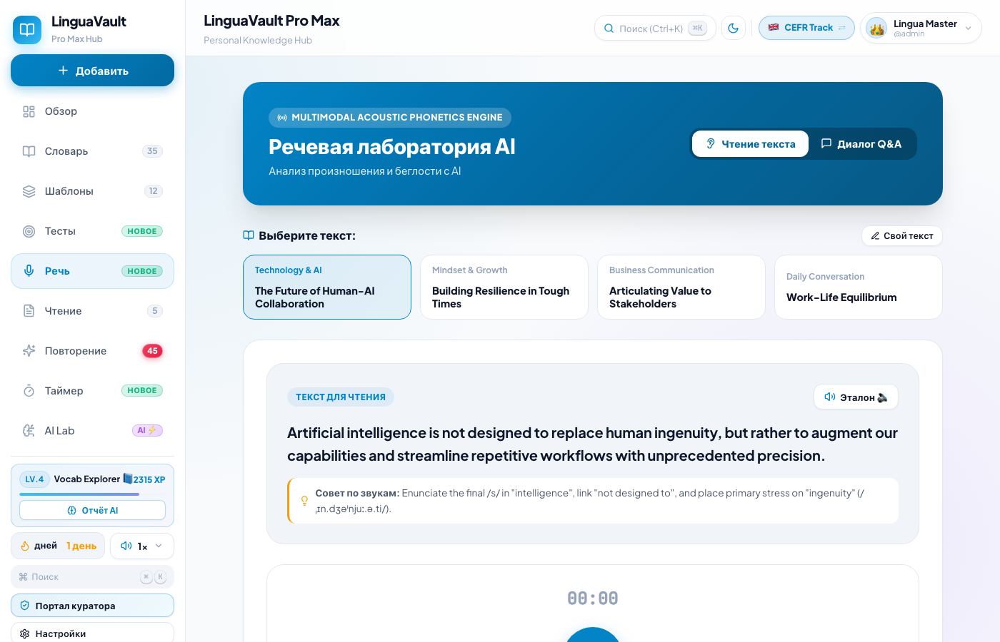

# 🌸 Инструкция по использованию приложения LinguaVault
### Руководство для пользователя: как учиться легко, с удовольствием и без зубрёжки

Привет! Это приложение создано для того, чтобы помочь тебе учить иностранный язык естественно, спокойно и эффективно. Тебе больше не нужно тратить часы на механическое заучивание списков слов — умная система сама подскажет, что и когда нужно повторить, чтобы всё запомнилось навсегда.

В этой инструкции простыми словами описано всё, что нужно знать для комфортных ежедневных занятий.

---

## 📑 Содержание
1. [Как войти в приложение и настроить русский язык](#1-как-войти-в-приложение-и-настроить-русский-язык)
2. [Главная страница — твой план на сегодня](#2-главная-страница--твой-план-на-сегодня)
3. [Как повторять слова по карточкам (Интервальное повторение)](#3-как-повторять-слова-по-карточкам-интервальное-повторение)
4. [Как настроить скорость и акцент диктора](#4-как-настроить-скорость-и-акцент-диктора)
5. [Словарь — твоя личная копилка слов](#5-словарь--твоя-личная-копилка-слов)
6. [Умное чтение — читаем интересные тексты с переводом](#6-умное-чтение--читаем-интересные-тексты-с-переводом)
7. [Лаборатория речи — тренируем разговор и произношение](#7-лаборатория-речи--тренируем-разговор-и-произношение)
8. [AI Лаборатория — запоминаем слова через увлекательные истории](#8-ai-лаборатория--запоминаем-слова-через-увлекательные-истории)
9. [Секреты эффективных занятий (10 минут в день)](#9-секреты-эффективных-занятий-10-минут-в-день)

---

## 1. Как войти в приложение и настроить русский язык

Когда ты впервые открываешь приложение, перед тобой появится экран входа.

### Что нужно сделать:
1. **Выбери русский язык**: в правом верхнем углу нажми на плашку **🇷🇺 Русский**. Все надписи и кнопки в приложении сразу станут на русском языке.
2. **Введи логин и пароль**:
   * **Имя пользователя:** `admin` (или твой персональный логин).
   * **Пароль:** `123456`.
3. Нажми кнопку **«Войти»**.

> 💡 **Совет:** Браузер предложит сохранить пароль — нажми «Сохранить», чтобы в следующий раз заходить в один клик без ввода данных.

---

## 2. Главная страница — твой план на сегодня

После входа ты попадаешь на **Главную панель (Dashboard)**. Это твой личный дневник успехов.

### На что обращать внимание:
* **🔥 Серия дней (Streak):** показывает, сколько дней подряд ты занимаешься. Старайся заходить хотя бы на 5–10 минут каждый день, чтобы огонёк не угас!
* **📚 К повторению сегодня (Due):** количество карточек, которые мозг вот-вот начнёт забывать. Именно их нужно повторить сегодня в первую очередь.
* **⭐ Уровень и Опыт (XP):** за каждое повторенное слово и прочитанный текст ты получаешь очки опыта (XP) и повышаешь свой уровень.
* **🚀 Кнопка «Начать повторение»:** просто нажми на неё, и тренировка начнётся!

---

## 3. Как повторять слова по карточкам (Интервальное повторение)

Это главное волшебство приложения. Оно использует научный алгоритм памяти (SM-2): слова, которые ты знаешь хорошо, будут появляться редко (через недели или месяцы), а трудные слова — чаще, пока не запомнятся намертво.

### Как проходит тренировка (3 простых шага):
1. **Посмотри на карточку:** ты видишь слово или фразу на изучаемом языке. Попробуй вспомнить его значение и произношение про себя.
2. **Нажми «Показать ответ»:** карточка перевернется, и ты увидишь перевод, пример предложения и услышишь правильное произношение.
3. **Честно нажми одну из 4 кнопок:**
   * 🔴 **Снова (Again):** если совсем забыла слово или ошиблась. Не расстраивайся! Карточка просто вернется в конец сегодняшней тренировки, чтобы ты закрепила её.
   * 🟠 **Трудно (Hard):** если вспомнила, но с трудом и долго думала. Приложение покажет его чуть раньше обычного.
   * 🟢 **Хорошо (Good):** самый частый выбор! Вспомнила уверенно и без особых усилий.
   * 🔵 **Легко (Easy):** очень простое слово, ты знаешь его назубок. Интервал повторения сразу увеличится на много дней.

> 🌟 **Золотое правило:** Не бойся нажимать кнопку **«Снова»**. Ошибки — это естественная часть обучения, именно так мозг строит самые крепкие нейронные связи!

---

## 4. Как настроить скорость и акцент диктора

Если диктор в озвучке говорит слишком быстро, скорость можно легко замедлить!

1. Внизу бокового меню найди кнопку с громкостью **`1x`**.
2. Нажми на неё — откроется удобная панель настройки:
   * **Скорость:** можно выбрать готовую кнопку (`0.75x`, `1.0x`, `1.25x`) или плавно подвигать ползунок. Для начинающих идеальна скорость **`0.8x – 0.9x`**.
   * **Акцент:** можно выбрать американский (🇺🇸 US) или британский (🇬🇧 UK) английский.
   * **Кнопка проверки:** нажми на синюю кнопку воспроизведения, чтобы сразу послушать тестовую фразу с новой скоростью.

---

## 5. Словарь — твоя личная копилка слов

В разделе **«Словарь» (Vocab Vault)** хранятся все слова, которые ты изучаешь.

* **Поиск:** введи любое слово на русском или английском в строку поиска, чтобы быстро найти его карточку.
* **Фильтры по темам:** нажимай на темы сверху (*Повседневная жизнь, Путешествия, Еда, Работа, Здоровье*), чтобы повторять слова по интересующей теме.
* **Звук 🔊:** нажимай на значок динамика рядом с любым словом, чтобы слушать правильное произношение сколько угодно раз.
* **Добавить новое слово (`+`):** нажми синюю кнопку «Добавить слово», напиши новое слово — система сама найдет транскрипцию и перевод!

---

## 6. Умное чтение — читаем интересные тексты с переводом

В разделе **«Чтение» (Smart Reader)** собраны интересные статьи и истории.

* **Мгновенный перевод по клику:** если ты встретила незнакомое слово в тексте, просто нажми на него пальцем или мышкой — сверху сразу появится всплывающее окошко с переводом!
* **Аудио для каждого предложения:** рядом с каждым предложением есть кнопка динамика. Нажми её, чтобы диктор прочитал фразу вслух с чистым, красивым произношением.
* **Контекст:** слова из твоих карточек подсвечиваются в тексте, поэтому ты сразу видишь, как они живут в настоящей живой речи.

---

## 7. Лаборатория речи — тренируем разговор и произношение

Раздел **«Говорение» (Speaking Lab)** помогает преодолеть языковой барьер и поставить красивое произношение.

1. **Режим «Чтение вслух»:**
   * Прочитай фразу на экране.
   * Обрати внимание на блок с лампочкой 💡 **«Советы по произношению»** на русском языке — там простыми словами объяснено, как правильно произнести сложные звуки и где сделать ударение.
2. **Запись голоса:**
   * Нажми на большую круглую кнопку с микрофоном 🎙️.
   * Произнеси фразу вслух.
   * Нажми «Стоп» — приложение покажет, насколько точно и понятно прозвучала фраза.

---

## 8. AI Лаборатория — запоминаем слова через увлекательные истории

Если какое-то слово никак не хочет запоминаться по отдельности, на помощь приходит искусственный интеллект!

* **Spaced Memory Story:** нажми кнопку генерации, и искусственный интеллект сочинит короткий забавный рассказ, в который гармонично вплетены именно те слова, которые ты учишь прямо сейчас!
* Мозг гораздо лучше запоминает сюжеты и эмоции, чем сухие списки — поэтому прочитав одну такую историю, ты запомнишь сразу 5–10 трудных слов без усилий.
* Историю можно не только прочитать, но и полностью прослушать в озвучке диктора.

---

## 9. Секреты эффективных занятий (10 минут в день)

Чтобы выучить язык легко и без выгорания, следуй этим трём простым правилам:

1. **Регулярность важнее количества часов:**  
   Лучше заниматься каждый день по **10–15 минут**, чем 2 часа один раз в неделю в воскресенье. Память любит короткие ежедневные касания.
2. **Утренний кофе или дорога:**  
   Повтори карточки утром за чашкой кофе или в транспорте. В приложении обычно всего 15–25 карточек на день, это занимает 5 минут!
3. **Хвали себя за каждый шаг:**  
   Каждое повторенное слово — это твой личный шаг вперёд к свободной речи. Смотри на растущий огонёк серии дней (Streak) и гордись своими успехами!

---

❤️ **Приятного и вдохновляющего обучения вместе с LinguaVault!**
